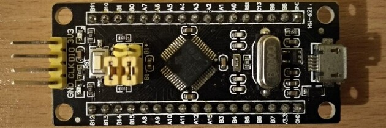

# Kconfig for ARM based MCUs

This example provides the ability to configure components and application
using kconfig language

Originally created for STM32 Black Pill but it can be used for any ARM
based MCUs


Development environment consists of:
 * Ubuntu OS
 * STM32CubeIDE
 * STM32CubeMX
 * STM32CubeProg
 * [Cppcheck](https://github.com/danmar/cppcheck.git)
 * [Cloc](https://github.com/AlDanial/cloc.git)

## Install

```bash
  sudo apt install bison flex
```

## Get GNU Arm Embedded Toolchain

```bash
  sudo apt install gcc-arm-none-eabi
```
```
  arm-none-eabi-gcc --version
```

Alternative way is to download
[Arm GNU Toolchain](https://developer.arm.com/Tools%20and%20Software/GNU%20Toolchain)
and setup path to compiler binaries by adding the following line
into ~/.profile with your path to toolchain folder:

```bash
  export PATH="$PATH:$HOME/path/to/gcc-arm-none-eabi-8-2019-q3-update/bin"
```

Log out and log back in to update PATH variable

## Get project and build

```bash
  git clone https://github.com/mcu/kconfig.git
```
```
  cd kconfig
  make menuconfig
  make
```
```
  make clean
  make -f scripts/Makefile clean
```

## How it works

At first, 'make' utility use 'ls' command recursively to create a list of all
folders in the 'components', 'application'. Then 'make' creates a list of all
*.s, *.c, *.ld and *.a files into variables CBMXASRC, CBMXLD, CBMXOBJS...
After that 'make' starts the process of compiling cubemx, components,
application sorce files in parallel, linking and generating binary file.
It's easy but more correctly is to build components separately into
libraries (for advanced developers https://github.com/mcu/kconfig-libs).

You can change cubemx source files using STM32CubeMX program or replace cubemx
folder with your own, small changes need to be made to the Makefile.

You can also add *.h, *.c files and folders as you want into "components",
"application" folders. All source files will be compiled

## Comment

Implementation of makefile has its pros and cons. Since all header files
are visible to each source file during the build process it is not recommended
to use this example for large projects
